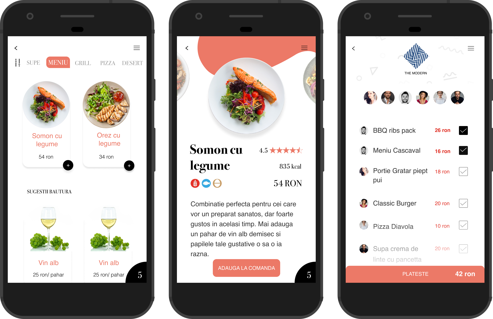

Dining out is not always a great experience. Sometimes you have to wait too much before ordering, wave your hands desperately to get another glass of wine, wait for the check and when you finally get it, start negociating with your friends on how to split the bill and how to pay.
There has to be better way in 2019. Why not have an app for this? Imagine you walk into the restaurant, have a seat, open the app, get smart personal recommendations and order right away, from within the app. When your order is ready, the waiter brings the food to your table and when you are done, you pay from the app, stand up and simply leave.

_“This is a great idea, let’s builld it!”_ is the first instinct. Without last year’s learnings from launching our first product, [Mony](http://mony.craftingsoftware.com/), a personal finance advisor app, we would have done just that. We would have worked three months on a prototype, involved our friends to gather feedback, tried to market it for another three months, entered start-up challenges and made newspaper headlines. All that only to find ourselves one year later pushing an ideea that doesn’t actually work.
Instead, it only took us one week to kill the idea and not a single line of code was written.

This is the first idea that came out of our improved Crafting Software Product Studio program. In a first step we look at indicators for urgency of the need, market size, pricing potential, cost of customer acquisition, industry landscape and several others. If it looks good on paper we list all assumptions with ruthless honesty and come up with tests to validate those assumptions quickly and cheaply. The goal is to avoid a bigger commitment before validating the business plan.
### The less than optimal dining experience
As with many other products on the market, the need comes from the founder’s own painful experiences. We felt the pain and we saw a way to improve the dining experience.

Sometimes you wait too much until you get a menu on the table. If the group is large, the waiter has to come back several times until everyone has decided. During the meal, if you need to ask for another glass of wine, you need to look for the waiter and wave. Not to mention the check. Now that you have already eaten, the waiter is prioritizing hungrier customers. When you finally get the check, the calculations start. You need to fish for the items you ordered and add the prices. How do you handle the payment as a group? One person pays the entire amount with the credit card while others either offer cash or transfer their part via Revolut. And finally the tips… If you don’t have any cash at all, you have to borrow from friends. If you only have large bills, you have to ask the waiter to split it.
This is such a mess, there has to be a better way.

### The solution and vision
You can split the dining experience in three stages and the app can reduce waiting times and friction in all of them.
##### The order
After being seated, you open the app, scan the QR code on the table and get taken to the digital version of the menu. You keep adding to the order and when it is complete you push a button to sent it to the kitchen. The waiter’s job is to take the food from the kitchen and bring it to your table.
##### The meal
During the meal you can order another drink or get some dessert. If you need to grab the waiter’s attention for any reason, you simply push a button.
##### The payment
The app displays the table’s order with your items already selected, so you again push a button and you are done. This also allows you to leave the group earlier without much fuss. Tips are optional but encouraged by the app.

The rollout plan was to make the app available in a small number of restaurants in Cluj-Napoca in order to gather feedback and get to a product-market fit. In the scaling phase, rollout the entire city and then expand nationally and internationally. This improved dining experience would become the new way of eating out and that would force reluctant restaurants to adopt it. You install the app once and use it everywhere.

Having access to lots of data also opens the door to personalization through artificial intelligence. The app knows what you like, what kind of allergies you have, the diets and caloric restrictions you are on and next time you open the menu, you get a personalized view instead of browsing through all items. It could also help restaurants sell more by recommending a wine that goes well with the pasta you just ordered or by recommending the cheesecake the data says you cannot resist.

In terms of business model, the money has to come from restaurants. They are the ones saving up by using fewer waiters, printing less menus, selling more food and drinks and providing a better experience to their customers. We could charge a fixed monthly fee that varies with the size of the restaurant or take a commission from each payment through the app.

Restaurants would be our user acquisition partners by placing a flyer on each table and encourage customers to try it. To convince customers to give it a try we would offer a discount for the first order or pay the tip for them.
### The assumptions
We started by questioning the most basic assumption of any business, the value proposition. In order to be successful, the app had to appeal to both restaurants and their customers, so we drafted an initial value proposition for both.
##### The restaurant
* Fewer waiters since there is less work to do. This is attractive in a market where it is already hard to find employees.
Since the job of the waiter becomes moving plates between the kitchen and dining room, you also need less skilled workers that you can find easier and pay less.
* Digital menus that are more appealing and easier to update. Menu items could have large photos, lengthier descriptions, number of calories, allergens, reviews, etc. Adding or removing becomes less expensive and most importantly, you can update the prices without printing all the menus again.
* Sell more or at a higher price. The app recommends complementary menu items based on customer preferences and restaurant strategy.
* Differentiate from your competition. By providing a superior experience, customers will come to you instead of choosing one of your competitors.

##### The customer
* Less waiting time at the beginning and end of the dining experience
* More convenient payments
* Personalized recommendations

This was the first set of assumptions that needed validation. There were of course others, but you cannot have a business without first creating value.
### The validation
One of the first signs we look at is how well the competition is doing. If others have tried it and it works, that is usually the first good sign. If there is no competition, that’s not good because most probably someone has already tried it and it doesn’t work.

Interestingly, we found two startups that have already tried the idea in Cluj-Napoca. Hip Menu has quickly pivoted to food delivery and is now the most successful app in the region. Fast Order has switched to fast food pick up and has even closed it’s operations in Romania and moved to other markets.  We also found a competitor in the US, [All Set](https://allsetnow.com/), with more than 2500 restaurants enrolled. Even though the website describes a dine-in service, by reading through the app store reviews it is pretty clear they are doing pick up only.
The signals were pretty strong, all businesses that have started with a dine-in value proposition have ended up doing delivery or pick up.

But we didn’t stop there. The idea seemed too good to be dismissed so quickly and we wanted to find out why and if indeed doesn’t work. The hope was for better timing, with a wider adoption of mobile payments and better and cheaper Wifi.

So we started validating the value proposition for restaurants because it is irrelevant if customers like the app but restaurants are not willing to pay for it. So the plan was to talk to a handful of restaurants and refine the proposal.
Once we were confident in the proposal, we planned on running a quantitative analysis by building a landing page and advertising to hundreds of restaurants to see how they react.

Meanwhile we also started conversations on other fronts with founders that have already tried the idea, with other software providers for the hospitality industry, sales people and other entrepreneurs with more experience in the digital space.
### Interview conclusions
After talking to 10 restaurant owners and administrators from Cluj-Napoca we found what we believe are the reasons why this kind of app doesn’t work, at least for the moment. The restaurants were chosen in order to cover a wider range of prices categories and customer segments. The majotity of the feedback was negative and consistent across most restaurants.
##### Customers don’t always know what to order
A trained waiter can make the experience of ordering much smoother by answering questions and recommending food and drinks based on customer preferences. A good waiter can sell items that have a higher profit margin, like a lemonade instead of a glass of water. There are also sales targets and expiration dates and the waiter takes those into account when persuading customers. Signature dishes or cocktails are also hard to sell without a skilled sales person who can tell a good story. One administrator mentioned that ideally he won’t even have menus on the tables, all orders would be placed after a conversation between customer and waiter.
##### The kitchen is the bottleneck during rush hours, not the waiting staff
Waiters play an important role in managing customer expectations. By introducing delays when bringing the menu, taking the order, placing the order, bringing the food and the check, they ensure that the kitchen and the bar are not blocked and customers get their warm food and cold drinks at once. This is a learned skill and something the restaurants heavily rely on. A bigger kitchen does not make sense because it is only needed at lunch and dinner and the space and staff would be idle the rest of the time.
That being said, it is much more bearable to wait one hour for your food when you interact multiple times with a human being instead of looking impatient at a phone screen.
##### Social interaction goes a long way in creating memorable experiences
In a city that doesn’t rely heavily on tourism, retaining customers makes more business sense than acquiring new ones. One restaurant administrator mentioned that he doesn’t want to change the decor every two years to remain “new” and attract more customers. Instead, he focuses on creating emotional connections and memorable experiences and that is hard to achieve without social interaction.
Social interaction is also in line with the hospitality brand. Restaurants want to treat customers as you would treat guests in your home. Interacting through an app goes in the opposite direction.
##### Less interactions results in smaller tips
The tips are tightly linked to the quality of the interaction between customers and staff. Even though there are studies that say otherwise, restaurant owners seem to think this is true. Less interactions means less or smaller tips. Small tips make a restaurant less attractive for waiters and combined with the workforce crisis that the hospitality industry is facing, this makes restaurants reluctant to try the solution.
##### Way too many integrations needed
Scalability was one of the most attractive parts of this business idea. Unfortunately this is not easily achievable in the hospitality industry. Most of the existing ERPs are closed systems and integration is not a breeze. More than that, the market is very segmented and we would have to integrate with many external systems just to cover a city. It’s hard to say if the international scene is different, but I am not very optimistic.
### Conclusion
Even though there were a couple of restaurants who saw the solution as promising for solving their staff crisis, most were not attracted by our initial value proposition for reasons that are hard to combat.
More than that, Cluj-Napoca and Romania in general is not a good market for such a product. Romanians are the worst spenders from the EU when it comes to eating out. Restaurant owners are very price sensitive when it comes to buying software solutions.

For all these reasons we decided not to go forward with this idea. The good news is that it only took us one week to reach this conclusion and it cost us only a few hours of research.
Not being invested in the idea made a world of difference. Instead of trying to sell the solution we were really able to listen to feedback and keep a cool head. That wouldn’t have been possible after working on a prototype even for a short amount of time.
